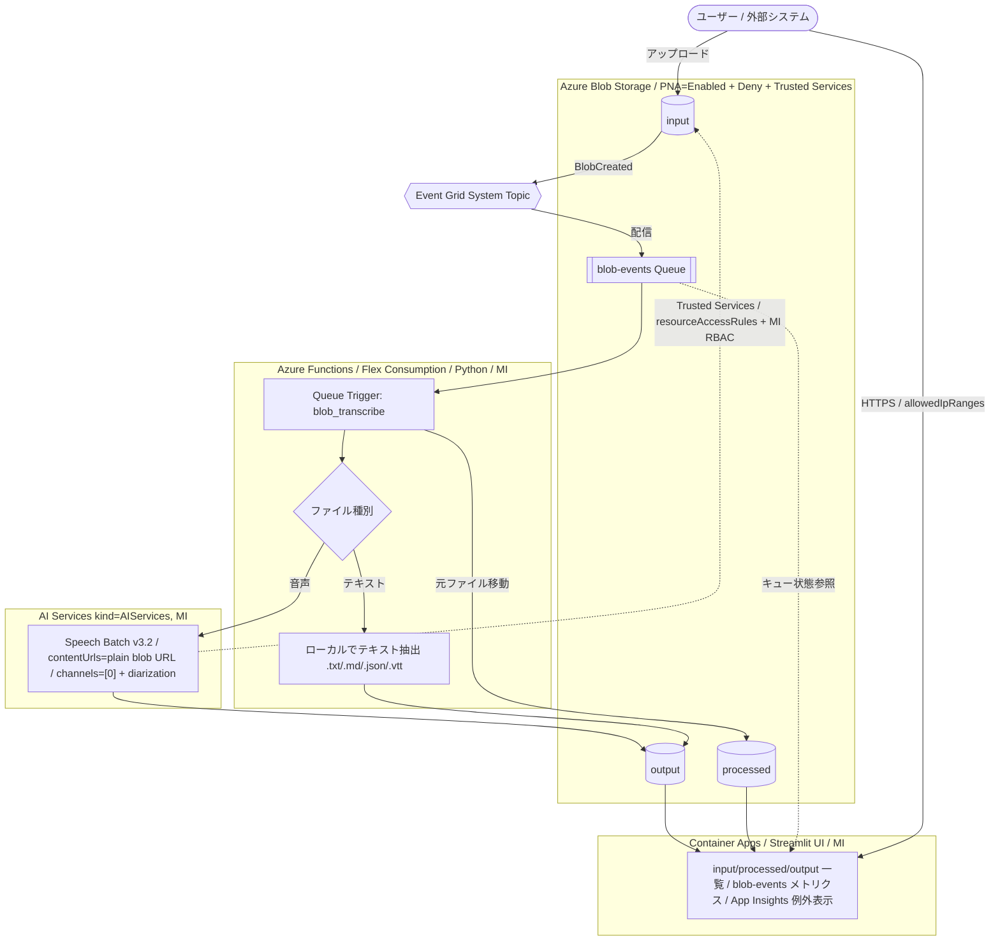

# Blob 文字起こしシステム — デプロイガイド

本ドキュメントは **環境セットアップ → プロビジョニング → デプロイ → 動作確認** までの全手順をまとめたものです。  
**すべてのコマンドはプロジェクトルート（`受電業務_Stage1/`）から実行してください。**

---

## ⚡ クイックスタート（最短手順）

すでに前提ツール（Azure CLI / azd / Python 3.11+）がインストール済みなら、以下 4 コマンドで完結します。詳細・補足は §0 以降を参照してください。

```powershell
# 1. ログイン（az / azd の両方）
az login
azd auth login

# 2. azd 環境初期化（プロジェクトルートで実行、環境名は dev/stg/prod 等）
azd init -e dev

# 3. インフラ作成 + アプリデプロイ（約 5〜10 分）
azd up

# 4. 出力された Endpoint URL をブラウザで開いて動作確認
```

---

## ディレクトリ構造

```
受電業務_Stage1/          ← プロジェクトルート（ここで全コマンド実行）
├── azure.yaml            ← azd プロジェクト定義
├── docs/
│   ├── deploy-guide.md   ← 本ドキュメント
│   └── requirement.md    ← 要件定義書
├── functions/            ← Azure Functions コード
│   ├── function_app.py
│   ├── host.json
│   └── requirements.txt
├── infra/                ← Bicep IaC
│   ├── main.bicep        ← エントリポイント
│   ├── main.parameters.json
│   └── modules/          ← リソース種別ごとのモジュール
│       ├── network.bicep
│       ├── storage.bicep
│       ├── acr.bicep
│       ├── ai.bicep
│       ├── monitoring.bicep
│       ├── functions.bicep
│       ├── eventgrid.bicep
│       └── container-apps.bicep
└── ui/                   ← Streamlit UI
    ├── app.py
    ├── blob_service.py
    ├── Dockerfile
    └── requirements.txt
```

## アーキテクチャ概要



### データストレージへのアクセスパス（閉域構成）

| アクセス元 | アクセス手段 | 認証 |
|---|---|---|
| Functions → Storage Blob/Queue | Private Endpoint | MI + Storage Blob/Queue Data Contributor |
| AI Services (Speech Batch) → Storage Blob | **Trusted Services**（`bypass=AzureServices` + `resourceAccessRules`） | MI + Storage Blob Data Reader |
| Container Apps (UI) → Storage Blob/Queue | **Private Endpoint**（ACA の VNet 統合 → Private DNS Zone で PE に名前解決） | MI + Storage Blob/Queue Data Reader |
| User → UI | Public HTTPS（`allowedIpRanges` で社内 IP のみに制限） | なし（「10. 今後の展望」参照、Entra ID 認証追加予定） |

> **Storage のセキュリティポスチャ**
> - `publicNetworkAccess: Enabled` ＋ `defaultAction: Deny` ＋ `bypass: AzureServices`（パブリック EP は開けているが ACL ですべて拒否）
> - `allowSharedKeyAccess: false`（SAS / アカウントキー一切使わず Entra ID 認証のみ）
> - `resourceAccessRules` で AI Services リソース ID を Trusted Service として登録
> - これにより Speech Batch は **プレーン blob URL（SAS 不要）** でアクセス可能
>
> ⚠️ **`publicNetworkAccess: Disabled` にしない**: Speech Batch Transcription は AI Services のパブリックエンドポイントから Source URL を fetch するため、ストレージ側を `Disabled` にすると Trusted Access (`resourceAccessRules`) が機能せず `InvalidData: The recordings URI contains invalid data.` で失敗します。

## 作成されるリソース

| リソース | 命名規則 | ポイント |
|---------|----------|------|
| Resource Group | `rg-transcription-{env}` | |
| VNet + 3 Subnets | `vnet-transcription-{env}` | snet-functions / snet-aca / snet-pe |
| Storage (データ) | `sttranscriptiondata{env}` | **`publicNetworkAccess=Enabled`** + `defaultAction=Deny` + Trusted Services bypass + `allowSharedKeyAccess=false`（パブリック EP は公開するが ACL で全拒否、Speech のみ `resourceAccessRules` で許可。`Disabled` だと Speech Batch Trusted Access が機能しないため） |
| Storage (Functions ランタイム) | `sttranscriptionfunc{env}` | **`publicNetworkAccess=Disabled`** / Flex Consumption 要件 (Blob+Table+Queue PE) / azd デプロイ時のみ hooks で一時開放 |
| Azure Functions (Flex Consumption) | `func-transcription-{env}-{hash}` | `publicNetworkAccess=Disabled` / VNet 統合 / MI |
| AI Services (Foundry 親リソース) | `ais-transcription-{env}` | `kind=AIServices` / `disableLocalAuth=true` / MI |
| Foundry Project | `proj-transcription-{env}` | Hub 不要スタンドアロン |
| Container Registry (Premium) | `acrtranscription{env}` | Premium SKU で PE サポート |
| Container App (Streamlit UI) | `ca-transcription-ui-{env}` | MI / `allowedIpRanges` で Ingress 制限可（認証は未実装、今後追加予定） |
| Event Grid System Topic | `evgt-blob-transcription-{env}` | Storage Queue (`blob-events`) に配信 |
| Log Analytics / App Insights | `log-` / `appi-transcription-{env}` | AMPLS 経由。**ingestion=PrivateOnly**（テレメトリ送信は Private Endpoint 経由のみ） / **query=Open**（PoC のため Azure Portal の Logs ブレード ・ ローカル PC から KQL 可能、本番時は PrivateOnly へ切り替え） |
| Private Endpoints + DNS Zones | 各リソースに対応 | blob/queue/table/cognitive/sites/azurecr/monitor |
| **Deployer RBAC** | — | azd 実行者（`AZURE_PRINCIPAL_ID`）に Storage Blob/Queue Data Contributor / AcrPush / Log Analytics Reader を自動付与。`infra/modules/deployer-rbac.bicep` 参照。 |

---

## 主要サービス・用語解説（初学者向け）

まず本システムで登場する Azure サービス・用語を簡単に説明します。すでに知っている方は読み飛ばしてください。

### Azure サービス

| サービス | 役割 | ひとこと解説 |
|---|---|---|
| **Azure Blob Storage** | オブジェクトストレージ | 音声/テキスト/結果ファイルを格納する「フォルダ＋ファイル」のクラウド版。`input` / `processed` / `output` の 3 コンテナを使う。 |
| **Azure Storage Queue** | 軽量メッセージキュー | Event Grid から受け取った blob 作成イベントを Functions が順に処理するためのバッファ。失敗が続いたメッセージは自動で `*-poison` キューに退避される。 |
| **Azure Event Grid** | イベント配信サービス | 「blob が作成された」というイベントをほぼリアルタイムに Storage Queue へ届ける。サーバーレスのトリガー基盤。 |
| **Azure Functions (Flex Consumption)** | サーバーレス関数実行基盤 | コードだけ書けば自動でスケールする。Flex Consumption は VNet 統合 + 高速スケールに対応した新プラン。 |
| **Azure AI Services (Speech)** | 音声認識 API | `Speech Batch Transcription v3.2` を使い、長尺音声を非同期に文字起こしする。`kind=AIServices` は Foundry の親リソース。 |
| **Azure AI Foundry Project** | AI 開発の論理プロジェクト | AI Services にぶら下がるプロジェクト単位。本システムでは Speech 利用時のスコープとして配置。 |
| **Azure Container Registry (ACR)** | コンテナイメージのレジストリ | UI 用 Docker イメージを格納。Premium SKU は Private Endpoint に対応。 |
| **Azure Container Apps (ACA)** | フルマネージド コンテナ実行基盤 | Streamlit UI をコンテナとしてホスト。スケール・HTTPS・MI を自動で面倒みてくれる。 |
| **Azure Virtual Network (VNet) / Subnet** | 仮想ネットワーク | Functions / ACA / Private Endpoint をそれぞれ別サブネットに収容し、閉域通信を構成。 |
| **Private Endpoint (PE)** | プライベート IP 経由の接続点 | Storage / ACR / AI Services などへ「インターネットを介さず」接続するための NIC。Private DNS Zone と組み合わせて使う。 |
| **Application Insights / Log Analytics** | 監視・ログ基盤 | Functions 実行ログ、例外、トレースを蓄積。UI からも KQL でクエリして表示する。 |

### セキュリティ・認証用語

| 用語 | 解説 |
|---|---|
| **Managed Identity (MI)** | Azure リソース自身が持つ Entra ID。パスワードや接続文字列を使わず、RBAC で他リソースにアクセスできる。本システムは全コンポーネント MI 認証。 |
| **RBAC (Role-Based Access Control)** | 「どの ID が、どのリソースに、何を」できるかを Role で付与する仕組み。例: `Storage Blob Data Reader` を AI Services の MI に付ける。 |
| **Trusted Services (信頼されたサービス)** | Storage が「特定の Azure サービスからのアクセスは Deny でも通す」例外設定。Speech Batch が SAS 不要で Storage を読めるのはこの仕組み。 |
| **disableLocalAuth / allowSharedKeyAccess=false** | アカウントキーや API キーでの認証を完全に無効化し、Entra ID のみ許可する設定。 |
| **SAS (Shared Access Signature)** | 期限付き署名 URL。本システムでは使用しない（Trusted Services + RBAC で代替）。 |

### ツール

| ツール | 解説 |
|---|---|
| **Azure CLI (`az`)** | Azure 操作の汎用 CLI。スクリプトや手動操作で利用。 |
| **Azure Developer CLI (`azd`)** | アプリ + IaC + デプロイをまとめて扱う「アプリ中心」の CLI。`azd up` 一発でインフラ作成〜コード配置まで完結。 |
| **Bicep** | Azure 専用の宣言的 IaC 言語（ARM テンプレートを簡潔にしたもの）。`infra/*.bicep` がそれ。 |
| **azd フック (preprovision/predeploy/postdeploy)** | `azure.yaml` で定義する PowerShell スクリプト。閉域環境の Public Access 一時開放など、IaC で表現しにくい運用を担当。 |

📚 **参考資料**
- [Azure Developer CLI とは](https://learn.microsoft.com/azure/developer/azure-developer-cli/overview)
- [Bicep の概要](https://learn.microsoft.com/azure/azure-resource-manager/bicep/overview)
- [マネージド ID の概要](https://learn.microsoft.com/entra/identity/managed-identities-azure-resources/overview)
- [Azure RBAC の概要](https://learn.microsoft.com/azure/role-based-access-control/overview)
- [Azure Functions Flex Consumption プラン](https://learn.microsoft.com/azure/azure-functions/flex-consumption-plan)
- [Speech Batch Transcription](https://learn.microsoft.com/azure/ai-services/speech-service/batch-transcription)
- [Storage の信頼されたサービス](https://learn.microsoft.com/azure/storage/common/storage-network-security#grant-access-to-trusted-azure-services)

---

## 0. 前提条件

### 必要なソフトウェア

| ソフトウェア | インストール方法 |
|-------------|-----------------|
| **VS Code** | https://code.visualstudio.com/ からダウンロード |
| **Python 3.11+** | `winget install Python.Python.3.11` |
| **Azure CLI** | `winget install Microsoft.AzureCLI` |
| **azd** | `winget install Microsoft.Azd` |

### 必要バージョン

| ツール | 最低バージョン |
|--------|---------------|
| Azure CLI | 2.60+ |
| azd | 1.9+ |
| Python | 3.11+ |

> **Terraform は不要です。** IaC は Bicep を使用し、azd が自動で処理します。

💡 **`winget` とは**: Windows 11 / 10 標準のパッケージマネージャー (`Windows Package Manager`)。`apt` や `brew` の Windows 版。管理者権限の PowerShell から `winget install <ID>` で導入できます。

📚 **参考資料**
- [Azure CLI のインストール](https://learn.microsoft.com/cli/azure/install-azure-cli-windows)
- [Azure Developer CLI のインストール](https://learn.microsoft.com/azure/developer/azure-developer-cli/install-azd)
- [Python のダウンロード](https://www.python.org/downloads/)
- [winget コマンドリファレンス](https://learn.microsoft.com/windows/package-manager/winget/)

---

## 1. 前提条件の確認

```powershell
# 前提ツールのバージョン確認
Write-Host "=== Azure CLI ==="
az version --output table 2>&1 | Select-Object -First 5

Write-Host "`n=== azd ==="
azd version

Write-Host "`n=== Python ==="
python --version
```

---

## 2. Azure ログイン

```powershell
# Azure CLI ログイン
az login

# azd ログイン
azd auth login

# サブスクリプション確認（複数ある場合は az account set --subscription <ID> で切替）
az account show --output table
```

<details>
<summary>📖 補足: なぜ 2 回ログインが必要か / 必要な権限</summary>

- **2 回ログインの理由**: `az` と `azd` はそれぞれ独自のトークンキャッシュを持つため、両方でログインが必要です。ブラウザが起動して Entra ID のサインイン画面が出るので、デプロイ先サブスクリプションへの権限を持つアカウントでサインインしてください。
- **必要な権限**: 対象サブスクリプションで `Contributor` 以上 + `User Access Administrator`（RBAC ロール割当のため）。`Owner` であれば両方を満たします。
- **azd 実行者への自動 RBAC 付与**: `azd provision` 時に `AZURE_PRINCIPAL_ID`（サインインユーザーの Entra ID オブジェクト ID）が自動注入され、以下のロールがデプロイ者本人に付与されます（`infra/modules/deployer-rbac.bicep`）。CI でサービスプリンシパルを使う場合は `azd env set AZURE_PRINCIPAL_TYPE ServicePrincipal` を実行してください。
  - **Storage Blob Data Contributor**（データ用 Storage）— `input` / `processed` / `output` コンテナへのアップロードとダウンロード
  - **Storage Queue Data Contributor**（データ用 Storage）— `blob-events-poison` キューの確認とクリア
  - **AcrPush**（ACR）— デバッグ時にローカルから手動でイメージ push
  - **Log Analytics Reader**（Log Analytics）— KQL クエリでログ調査
  - これらにより、`azd up` 後に追加のコマンドなしで Azure CLI / Portal / VS Code 拡張から直接 Blob を操作したりログを調査したりできます。

</details>

📚 **参考資料**
- [az login コマンドリファレンス](https://learn.microsoft.com/cli/azure/reference-index#az-login)
- [azd auth login](https://learn.microsoft.com/azure/developer/azure-developer-cli/reference#azd-auth-login)
- [Azure 組み込みロール一覧](https://learn.microsoft.com/azure/role-based-access-control/built-in-roles)

---

## 3. azd 環境の初期化

プロジェクトルート (`受電業務_Stage1/`) で実行してください。環境名は `dev` / `stg` / `prod` 等を指定します。

```powershell
# 現在のディレクトリ確認（プロジェクトルートにいるか）
Write-Host "Current Directory: $(Get-Location)"

# azd 環境初期化（初回のみ。サブスクリプションとリージョンを対話的に選択）
azd init -e dev
```

> **対話プロンプトで「Use code in the current directory」を選択してください。** 既に `azure.yaml` が存在するため、既存構成が認識されます。

<details>
<summary>📖 補足: azd 環境とは / カレントディレクトリの扱い</summary>

- **azd 環境**: 1 つの azd プロジェクトに対し、デプロイ先（サブスクリプション・リージョン・パラメータ値）を切り替えるための「プロファイル」。`.azure/<env>/.env` に保存され、`azd env get-value <KEY>` で参照できます。
- **カレントディレクトリ**: VS Code で「Open Folder」→「受電業務_Stage1」を開いていれば自動設定済み。別の場所から開いている場合は `Set-Location "C:\path\to\受電業務_Stage1"` で移動してください。

</details>

📚 **参考資料**
- [azd init コマンド](https://learn.microsoft.com/azure/developer/azure-developer-cli/reference#azd-init)
- [azd 環境の管理](https://learn.microsoft.com/azure/developer/azure-developer-cli/manage-environment-variables)
- [azure.yaml スキーマ](https://learn.microsoft.com/azure/developer/azure-developer-cli/azd-schema)

---

## 4. プロビジョニング + デプロイ

プロジェクトルートで以下を実行してください。これだけで全 Azure リソースの作成 + アプリの配置まで完了します。

```powershell
# プロジェクトルートで実行
azd up
```

**所要時間の目安**: 約 **5〜10 分**（実測値）。初回環境では Foundry / AMPLS の作成等で多少前後します。

完了すると `Endpoint: https://ca-transcription-ui-...azurecontainerapps.io/` のように UI の URL が表示されます。次の §5 に進んで動作確認してください。

---

<details>
<summary>📖 補足 1: <code>azd up</code> が裏側で何をしているか</summary>

`azd up` は以下 4 ステップを自動で順に実行する複合コマンドです：

1. **provision** — Bicep テンプレート（`infra/`）で全 Azure リソースを作成
2. **predeploy** （フック）— Functions / ACR の Public Access を一時開放（閉域構成のためデプロイ時のみ必要）
3. **deploy** — Functions コードデプロイ + UI イメージを ACR リモートビルド（Docker Desktop 不要）
4. **postdeploy** （フック）— Public Access を再閉鎖

> **ACR リモートビルドとは**: Docker Desktop をローカルにインストールしなくても、Dockerfile と UI コードを ACR にアップロードすれば ACR 側でイメージをビルドしてくれる仕組み（`az acr build` 相当）。閉域 ACR でも `predeploy` フックが一時的に Public Access を開けるので利用可能です。

</details>

<details>
<summary>📖 補足 2: 個別コマンド（インフラ/コードを別々に再実行したい場合）</summary>

初回は `azd up` だけで完結します。以下は **2 回目以降に「インフラだけ」「UI だけ」を再実行したい場合** のリファレンスです。

```powershell
# インフラのみ作成（コードデプロイなし）
azd provision

# コード/コンテナのみデプロイ（インフラ変更なし）
azd deploy

# Functions のみ再デプロイ
azd deploy functions

# UI のみ再デプロイ（Dockerfile → ACR リモートビルド → Container App 更新）
azd deploy ui
```

</details>

<details>
<summary>📖 補足 3: Container App の <code>exists</code> パターン（なぜ初回はプレースホルダー画像で立ち上がるか）</summary>

**現象**: VNet 統合された Container App に対して Bicep で ACR レジストリ設定を含めて初回作成すると、AcrPull ロール付与のレース条件 + プラットフォーム側の認証検証タイミングにより `Operation expired` で 20 分タイムアウトします（[Microsoft 公式 Issue](https://github.com/microsoft/azure-container-apps/issues/1004)）。`minReplicas=0` でも ACA プラットフォームが readiness probe のため初期レプリカを必ず起動するため回避できません。

**対策**: 本テンプレートは Microsoft 公式推奨の [`exists` パターン](https://github.com/microsoft/azure-container-apps/tree/main/templates/bicep/ruleBasedRouting) を採用：

- **初回 provision** (`uiExists=false`): `registries: []` + 公開プレースホルダー (`mcr.microsoft.com/azuredocs/containerapps-helloworld`) のみで作成 → ACR 認証を介さずに起動
- **`azd deploy ui` 実行後** (`uiExists=true` を azd が自動セット): `fetch-container-image.bicep` が前回デプロイイメージを取得し、ACR registries 経路に切り替え

そのため `azd up` の途中で UI を開いても helloworld 画面が出るのが正常で、`azd deploy ui` 完了後に Streamlit UI に切り替わります。

✅ **検証済み実測時間**（別 RG で実機検証）:
- 初回 `azd provision`: **約 3 分**（ACA は 17 秒で作成、Operation expired なし）
- `azd deploy ui`: **約 1 分 40 秒**（Remote build → ACR push → ACA revision 更新）
- 2 回目以降の `azd provision`（`uiExists=true`）: **約 3 分**（ACA は ACR 実イメージを引き継ぎ 17 秒で更新）

</details>

📚 **参考資料**
- [azd up / provision / deploy リファレンス](https://learn.microsoft.com/azure/developer/azure-developer-cli/reference)
- [azd フック (preprovision/postdeploy 等)](https://learn.microsoft.com/azure/developer/azure-developer-cli/azd-schema#hooks)
- [ACR でのリモートイメージビルド (`az acr build`)](https://learn.microsoft.com/azure/container-registry/container-registry-quickstart-task-cli)
- [Bicep デプロイの概要](https://learn.microsoft.com/azure/azure-resource-manager/bicep/deploy-cli)

---

## 5. デプロイ結果の確認

💡 **azd 環境変数**: Bicep の `output` で出力した値（リソース名、URL など）は自動で azd 環境にも書き戻されます。`azd env get-value <KEY>` でいつでも取り出せ、後段の PowerShell から `$rg = (azd env get-value AZURE_RESOURCE_GROUP)` のように利用できます。

Bicep outputs と azd 環境変数が正しく設定されていることを確認します。

```powershell
# azd 環境変数の確認
azd env get-values | Select-String -Pattern "AZURE_RESOURCE_GROUP|SERVICE_|AZURE_CONTAINER"
```

```powershell
# リソースグループ内のリソース一覧
$rg = (azd env get-value AZURE_RESOURCE_GROUP)
Write-Host "Resource Group: $rg`n"
az resource list -g $rg --output table --query "[].{Name:name, Type:type, Location:location}"
```

💡 **`--query` オプション**: Azure CLI が組み込みでサポートする [JMESPath](https://jmespath.org/) クエリ。出力 JSON から必要な項目だけを抽出・整形できます。

📚 **参考資料**
- [azd env コマンド](https://learn.microsoft.com/azure/developer/azure-developer-cli/reference#azd-env)
- [Azure CLI の JMESPath クエリ](https://learn.microsoft.com/cli/azure/query-azure-cli)
- [Bicep outputs](https://learn.microsoft.com/azure/azure-resource-manager/bicep/outputs)

---

## 6. Functions の動作確認

💡 **Queue Trigger**: 本 Functions は Storage Queue にメッセージが入ると自動起動する「Queue Trigger」型です。`function_app.py` 内で `@app.queue_trigger(...)` デコレータが付いた関数が、`blob-events` キューを監視しています。

```powershell
# Functions アプリの状態確認
$rg = (azd env get-value AZURE_RESOURCE_GROUP)
$funcName = (azd env get-value SERVICE_FUNCTIONS_RESOURCE_NAME)

Write-Host "=== Function App: $funcName ==="
az functionapp show -n $funcName -g $rg --query "{State:state, DefaultHostName:defaultHostName, VnetIntegration:virtualNetworkSubnetId}" -o table
```

```powershell
# Functions のデプロイ済み関数一覧
$rg = (azd env get-value AZURE_RESOURCE_GROUP)
$funcName = (azd env get-value SERVICE_FUNCTIONS_RESOURCE_NAME)

az functionapp function list -n $funcName -g $rg --output table
```

```powershell
# Functions のアプリ設定確認（接続先が正しいか）
$rg = (azd env get-value AZURE_RESOURCE_GROUP)
$funcName = (azd env get-value SERVICE_FUNCTIONS_RESOURCE_NAME)

az functionapp config appsettings list -n $funcName -g $rg --output table `
  | Select-String -Pattern "DATA_STORAGE|AI_SERVICES|SPEECH|DataStorage"
```

📚 **参考資料**
- [Azure Functions Python 開発者ガイド](https://learn.microsoft.com/azure/azure-functions/functions-reference-python)
- [Queue ストレージトリガー](https://learn.microsoft.com/azure/azure-functions/functions-bindings-storage-queue-trigger)
- [Flex Consumption プランの仕様](https://learn.microsoft.com/azure/azure-functions/flex-consumption-plan)

---

## 7. Container App (UI) の動作確認

💡 **Container Apps の Ingress**: 外部公開された HTTPS エンドポイント。`<app>.<env>.<region>.azurecontainerapps.io` の FQDN が自動払い出され、TLS 証明書も自動管理されます。`allowedIpRanges` パラメータで社内 IP のみに絞ることも可能です。

> ⚠️ **現時点でユーザー認証は未実装です。** `allowedIpRanges` による IP 制限のみで保護されているため、本番運用前に「15. 現状と今後の本番展開時の対応」に記載の Microsoft Entra ID 認証を追加してください。

```powershell
# Container App の状態確認
$rg = (azd env get-value AZURE_RESOURCE_GROUP)
$uiName = (azd env get-value SERVICE_UI_RESOURCE_NAME)

Write-Host "=== Container App: $uiName ==="
az containerapp show -n $uiName -g $rg --query "{ProvisioningState:properties.provisioningState, FQDN:properties.configuration.ingress.fqdn, RunningStatus:properties.runningStatus}" -o table
```

```powershell
# UI の URL を取得して表示
$rg = (azd env get-value AZURE_RESOURCE_GROUP)
$uiName = (azd env get-value SERVICE_UI_RESOURCE_NAME)

$fqdn = az containerapp show -n $uiName -g $rg --query "properties.configuration.ingress.fqdn" -o tsv
$url = "https://$fqdn"
Write-Host "UI URL: $url"
Write-Host "`nブラウザで開く場合:"
Write-Host "  Start-Process $url"
```

📚 **参考資料**
- [Azure Container Apps の概要](https://learn.microsoft.com/azure/container-apps/overview)
- [Container Apps の Ingress 設定](https://learn.microsoft.com/azure/container-apps/ingress-overview)
- [Streamlit 公式ドキュメント](https://docs.streamlit.io/)

---

## 8. 閉域構成（Private Endpoint）の確認

💡 **Private Endpoint (PE)**: 対象リソース（Storage、ACR、AI Services 等）に VNet 内のプライベート IP を割り当て、インターネットを経由せず通信させる機能。Private DNS Zone と組み合わせることで、`*.blob.core.windows.net` などの公式 FQDN がそのままプライベート IP に解決されます。

💡 **`publicNetworkAccess=Disabled`**: PE 以外からのアクセスを完全遮断する設定。本システムでは Functions / ACR / AI Services / Storage（条件付き）で有効化されています。

すべてのリソースが Private Endpoint 経由でアクセスされていることを確認します。

```powershell
# Private Endpoint 一覧
$rg = (azd env get-value AZURE_RESOURCE_GROUP)

az network private-endpoint list -g $rg --output table --query "[].{Name:name, Subnet:subnet.id, ProvisioningState:provisioningState, PrivateIP:customDnsConfigs[0].ipAddresses[0]}"
```

```powershell
# Public Access が無効になっていることを確認
$rg = (azd env get-value AZURE_RESOURCE_GROUP)
$funcName = (azd env get-value SERVICE_FUNCTIONS_RESOURCE_NAME)
$acrName = (azd env get-value AZURE_CONTAINER_REGISTRY_NAME)

Write-Host "=== Functions Public Access ==="
az functionapp show -n $funcName -g $rg --query "publicNetworkAccess" -o tsv

Write-Host "`n=== ACR Public Access ==="
az acr show -n $acrName --query "publicNetworkAccess" -o tsv

Write-Host "`n=== Storage (Data) Public Access ==="
$stName = az storage account list -g $rg --query "[?contains(name,'data')].name" -o tsv
az storage account show -n $stName --query "networkRuleSet.defaultAction" -o tsv
```

📚 **参考資料**
- [Azure Private Endpoint の概要](https://learn.microsoft.com/azure/private-link/private-endpoint-overview)
- [Private DNS Zone と統合](https://learn.microsoft.com/azure/private-link/private-endpoint-dns)
- [Storage アカウントのネットワークセキュリティ](https://learn.microsoft.com/azure/storage/common/storage-network-security)

---

## 9. E2E 動作確認 — テストファイルのアップロード

💡 **E2E (End-to-End) テスト**: 「ユーザーが操作する起点」から「最終結果」までを一気通貫で検証するテスト。本システムでは「`input` コンテナへのアップロード」が起点、「`output` への文字起こし結果出力 + `processed` への原本退避」が終点です。

💡 **`--auth-mode login`**: Storage CLI 操作で「アカウントキーではなく Entra ID トークンで認証する」指定。アカウントキーが無効化（`allowSharedKeyAccess=false`）された本システムでは必須です。

Storage Account の `input` コンテナにファイルをアップロードし、  
Event Grid → Queue → Functions → output/processed の流れを検証します。

> **注意**: データ Storage は `publicNetworkAccess=Enabled` だが `defaultAction=Deny` でパブリックエンドポイントを ACL 全拒否しているため、CLI からのアップロードには**クライアント IP を一時許可**する必要があります（Speech Batch の Trusted Access を生かすため `publicNetworkAccess=Disabled` にしてはいけません）。テスト完了後はセクション 11 で IP ルールを必ず削除してください。

```powershell
# データ Storage のファイアウォールに自分の IP を許可追加
$rg = (azd env get-value AZURE_RESOURCE_GROUP)
$stName = az storage account list -g $rg --query "[?contains(name,'data')].name" -o tsv
$myIp = (Invoke-RestMethod -Uri 'https://api.ipify.org')

Write-Host "Adding IP: $myIp to $stName firewall..."
az storage account network-rule add -g $rg --account-name $stName --ip-address $myIp --output none
Write-Host "Waiting 15s for propagation..."
Start-Sleep -Seconds 15
Write-Host "Done. IP added."
```

```powershell
# テスト用テキストファイルをアップロード
$rg = (azd env get-value AZURE_RESOURCE_GROUP)
$stName = az storage account list -g $rg --query "[?contains(name,'data')].name" -o tsv

# サンプルテキストファイルを作成
$testContent = "これはBLOB文字起こしシステムのE2Eテスト用テキストファイルです。`nシステムが正しく動作していれば、このファイルがprocessedコンテナに移動し、outputコンテナにメタデータ付きで出力されます。"
$testFile = Join-Path $env:TEMP "e2e-test-$(Get-Date -Format 'yyyyMMdd-HHmmss').txt"
$testContent | Set-Content -Path $testFile -Encoding UTF8

Write-Host "Uploading: $testFile"
az storage blob upload `
  --account-name $stName `
  --container-name input `
  --file $testFile `
  --name (Split-Path $testFile -Leaf) `
  --auth-mode login `
  --overwrite

Write-Host "`nUpload complete. Waiting for processing..."
```

```powershell
# 処理結果を確認（30秒～2分程度待ってから実行）
$rg = (azd env get-value AZURE_RESOURCE_GROUP)
$stName = az storage account list -g $rg --query "[?contains(name,'data')].name" -o tsv

Write-Host "=== output コンテナ（変換結果） ==="
az storage blob list --account-name $stName --container-name output --auth-mode login --output table --query "[].{Name:name, Size:properties.contentLength, LastModified:properties.lastModified}" 2>&1

Write-Host "`n=== processed コンテナ（処理済み原本） ==="
az storage blob list --account-name $stName --container-name processed --auth-mode login --output table --query "[].{Name:name, Size:properties.contentLength, LastModified:properties.lastModified}" 2>&1

Write-Host "`n=== input コンテナ（処理完了後は空になるはず） ==="
az storage blob list --account-name $stName --container-name input --auth-mode login --output table --query "[].{Name:name}" 2>&1
```

```powershell
# output コンテナの変換結果をダウンロードして内容確認
$rg = (azd env get-value AZURE_RESOURCE_GROUP)
$stName = az storage account list -g $rg --query "[?contains(name,'data')].name" -o tsv

$latestBlob = az storage blob list --account-name $stName --container-name output --auth-mode login --query "sort_by([],&properties.lastModified)[-1].name" -o tsv
if ($latestBlob) {
    Write-Host "Latest output: $latestBlob`n"
    az storage blob download --account-name $stName --container-name output --name $latestBlob --auth-mode login --file - 2>$null
} else {
    Write-Host "output コンテナにファイルがありません。Functions のログを確認してください。"
}
```

📚 **参考資料**
- [Event Grid と Blob Storage 統合](https://learn.microsoft.com/azure/storage/blobs/storage-blob-event-overview)
- [az storage blob コマンド](https://learn.microsoft.com/cli/azure/storage/blob)
- [Entra ID で Blob にアクセス](https://learn.microsoft.com/azure/storage/blobs/authorize-access-azure-active-directory)

---

## 10. Functions ログの確認

💡 **Application Insights**: Azure Monitor の APM（Application Performance Management）コンポーネント。Functions 実行のトレース、例外、依存呼び出しが自動収集されます。クエリ言語は **KQL (Kusto Query Language)**。

💡 **poison キュー**: Storage Queue Trigger が `MAX_RETRIES` 回（既定 5 回）処理に失敗したメッセージを自動退避する `<キュー名>-poison` キュー。Functions ランタイムが自動作成するため Bicep 不要。

💡 **AMPLS とクエリ経路**: 本 PoC では AMPLS を **ingestion=PrivateOnly / query=Open** でデプロイしています。テレメトリ送信は VNet 統合済みの Functions / Container Apps から Private Endpoint 経由のみ許可、クエリは Azure Portal の Logs ブレードやローカル PC からの `az monitor app-insights query` も受け付けます。本番展開時は query も `PrivateOnly` に切り替え、Bastion / Jumpbox 経由でのクエリ運用に変更してください（§15.2 参照）。

処理が失敗した場合、Application Insights のログを確認します。UI の「処理状況」タブ（§13）からも KQL でエラー / poison キューを確認できます。

```powershell
# Application Insights のログストリーム（直近5分）
$rg = (azd env get-value AZURE_RESOURCE_GROUP)
$funcName = (azd env get-value SERVICE_FUNCTIONS_RESOURCE_NAME)

Write-Host "=== Functions 実行ログ（直近の呼び出し） ==="
az monitor app-insights query -g $rg `
  --app "appi-transcription-dev" `
  --analytics-query "traces | where timestamp > ago(5m) | order by timestamp desc | project timestamp, message, severityLevel | take 20" `
  --output table 2>&1
```

```powershell
# Queue のメッセージ数を確認（処理待ちキュー）
$rg = (azd env get-value AZURE_RESOURCE_GROUP)
$stName = az storage account list -g $rg --query "[?contains(name,'data')].name" -o tsv

Write-Host "=== blob-events キュー ==="
az storage queue metadata show --name blob-events --account-name $stName --auth-mode login --output json 2>&1
```

📚 **参考資料**
- [Application Insights の概要](https://learn.microsoft.com/azure/azure-monitor/app/app-insights-overview)
- [KQL クイックリファレンス](https://learn.microsoft.com/azure/data-explorer/kql-quick-reference)
- [Functions の poison キューとリトライ](https://learn.microsoft.com/azure/azure-functions/functions-bindings-storage-queue-trigger#poison-messages)

---

## 11. クリーンアップ（テスト IP の除去）

動作確認が完了したら、セクション 9 で一時追加した IP ルールを削除し、Storage を `resourceAccessRules` のみを許可する状態に戻します（`publicNetworkAccess=Enabled` + `defaultAction=Deny` はそのまま維持：Speech Batch Trusted Access に必要）。

```powershell
# テスト用 IP ルールの削除
$rg = (azd env get-value AZURE_RESOURCE_GROUP)
$stName = az storage account list -g $rg --query "[?contains(name,'data')].name" -o tsv
$myIp = (Invoke-RestMethod -Uri 'https://api.ipify.org')

Write-Host "Removing IP: $myIp from $stName firewall..."
az storage account network-rule remove -g $rg --account-name $stName --ip-address $myIp --output none
Write-Host "Done. Public IP allow list cleared. Storage continues to allow only AI Services (Trusted Service)."
```

---

## 12. 環境の削除（必要時のみ）

**注意: この操作は元に戻せません。** 全リソースが削除されます。

💡 **`azd down --purge`**: リソースグループ内の全リソースを削除し、さらに Key Vault や AI Services などの「ソフトデリート対応リソース」も完全パージします。`--purge` を付けないと同名で再作成できない（または `purge` 権限不足エラー）ことがあります。

```powershell
# 環境全体の削除（確認プロンプトあり）
# azd down --purge
```

📚 **参考資料**
- [azd down コマンド](https://learn.microsoft.com/azure/developer/azure-developer-cli/reference#azd-down)
- [Cognitive Services のソフトデリート](https://learn.microsoft.com/azure/ai-services/recover-purge-resources)

---

## 13. UI からの処理状況・エラー監視

💡 **Streamlit**: Python だけでデータ系の Web UI を構築できる OSS フレームワーク。本システムでは `ui/app.py` がすべてのタブ・チャート・ボタンを定義しています。

Streamlit UI の **「📊 処理状況」タブ** で以下が一目で確認できます。

| メトリクス / セクション | 内容 |
|---|---|
| 📥 処理待ち (input) | `input` コンテナの未処理ファイル件数 |
| 📨 Queue (blob-events) | 主キュー件数 + **`❌ poison: N`**（リトライ尽きで失敗した件数） |
| ✅ 処理済み (processed) | `processed` コンテナの件数 |
| 📄 文字起こし (output) | `output` コンテナの結果ファイル件数 |
| ❌ 処理失敗・エラー（直近24時間） | poison キュー内のファイル名・失敗時刻 + App Insights の Error/Exception ログ（実際の Speech エラーメッセージが見える） |
| 📋 Functions 実行ログ | App Insights から直近1時間のトレース |

**ポイント**:
- poison queue (`blob-events-poison`) はリトライ上限 (`MAX_RETRIES`) に達したメッセージが自動的に格納される Functions ランタイムの仕組み。Bicep / 手動作成不要。
- 失敗ファイル名は Event Grid イベント `subject` から自動抽出。
- App Insights クエリは `LOG_ANALYTICS_WORKSPACE_ID` 環境変数から動的取得。

```powershell
# poison queue の件数を CLI で直接確認
$rg = (azd env get-value AZURE_RESOURCE_GROUP)
$stName = az storage account list -g $rg --query "[?contains(name,'data')].name" -o tsv
az storage queue exists --name blob-events-poison --account-name $stName --auth-mode login -o tsv
az storage message peek --queue-name blob-events-poison --account-name $stName --auth-mode login --num-messages 10 -o table 2>&1
```

📚 **参考資料**
- [Streamlit ドキュメント](https://docs.streamlit.io/)
- [Storage Queue の概要](https://learn.microsoft.com/azure/storage/queues/storage-queues-introduction)

---

## 14. 音声フォーマット要件とトラブルシューティング

💡 **Speech Batch Transcription**: 長尺音声を非同期でまとめて文字起こしする Speech API。投入時に `contentUrls`（音声 blob の URL 配列）を渡すと、内部ジョブが進み完了後に結果 JSON が取得できます。本システムは v3.2 を利用。

💡 **`ffprobe` / `ffmpeg`**: メディアファイルの解析（`ffprobe`）と変換（`ffmpeg`）を行う OSS ツール群。`winget install Gyan.FFmpeg` で導入可能。

### Speech Batch Transcription がサポートする音声形式

| 項目 | サポート範囲 |
|---|---|
| コンテナ | WAV / MP3 / OGG / FLAC / ALAW (8kHz) / MULAW (8kHz) / AMR / WebM / M4A / SPEEX |
| MP3 コーデック | **MPEG-1/2 Audio Layer III のみ**（MPEG-2.5 や AAC を `.mp3` 拡張子にしたものは不可） |
| サンプリングレート | 8 / 16 / 32 / 44.1 / 48 kHz |
| チャンネル | mono / stereo（diarization 利用時は mono/stereo 推奨） |

### `InvalidData: The recordings URI contains invalid data` の原因切り分け

このエラーは **Speech が URL は取得できたが内容を受け付けなかった** 場合に発生します（ネットワーク・RBAC は正常）。

```powershell
# ローカルにファイルを取得後、ffprobe で実体を確認（要 ffmpeg インストール: winget install Gyan.FFmpeg）
ffprobe -v error -show_streams -show_format <file>.mp3
# \u6ce8\u76ee: codec_name, sample_rate, channels, format_name
```

| ffprobe 結果 | 原因 | 対処 |
|---|---|---|
| `codec_name` が `mp3` 以外（例: `aac`, `opus`） | **拡張子詐称**（中身が別フォーマット） | 正しい拡張子に変更して再投入 |
| `codec_name=mp3` だが極端な低ビットレート (< 32 kbps) | MPEG-2.5 / 非標準 mp3 | 下記 ffmpeg で WAV に変換 |
| サンプリングレートが非対応値 (例: 11025 Hz) | リサンプル必要 | 同上 |
| ファイル取得自体に失敗 | コンテナ破損 | 元データを再取得 |

### 確実に通る形式への変換（推奨フォールバック）

```powershell
# 16 kHz / 16 bit / mono PCM WAV — Speech Batch が確実に受け付ける形式
ffmpeg -i input.mp3 -ac 1 -ar 16000 -sample_fmt s16 output.wav
```

> **将来の自動化**: Functions に `pydub` + `ffmpeg` を組み込み、Speech 投入前に WAV へ変換するパスを Stage 2 で検討予定。

📚 **参考資料**
- [Speech Batch Transcription REST API v3.2](https://learn.microsoft.com/azure/ai-services/speech-service/batch-transcription)
- [サポートされる音声形式](https://learn.microsoft.com/azure/ai-services/speech-service/batch-transcription-audio-data)
- [FFmpeg 公式ドキュメント](https://ffmpeg.org/documentation.html)

---

## トラブルシューティング

### よくあるエラーと対処

| 症状 | 対処 |
|------|------|
| `azd provision` でエラー | `az deployment sub what-if` で Bicep テンプレートの問題を確認 |
| `azd deploy` で Functions デプロイ失敗 | `predeploy` フックで Public Access が開放されているか確認 |
| `azd deploy` で ACR push 失敗 | ACR の Public Access が一時開放されているか確認 |
| ファイルアップロード後に output が出ない | UI の「処理状況」タブで poison queue とエラーログを確認（セクション 13） |
| `Transcription failed: ... InvalidData ...` | 音声ファイルのコーデック不適合。`ffprobe` で確認し WAV に変換（セクション 14） |
| Speech が `Failed: Forbidden` / `AuthorizationFailure` | Storage の `resourceAccessRules` に AI Services ID が登録されているか、AI Services MI に `Storage Blob Data Reader` が付与されているか確認 |
| 音声ファイルの文字起こしに失敗（その他） | AI Services の RBAC (`Cognitive Services Speech User`) を確認 |
| UI が表示されない | Container App の Ingress FQDN とプロビジョニング状態を確認 |
| `azd down` 後にリソースが残る | `az group delete -n rg-transcription-dev --yes` で強制削除 |
| `RoleAssignmentExists` エラーで provision が失敗 | 古い role assignment を `az role assignment delete --ids <id>` で手動削除後再実行 |
| Container App が `Operation expired` で失敗（初回プロビジョニング時） | VNet 統合 ACA で ACR レジストリを含めて作成すると ACA プラットフォームの認証検証と AcrPull RBAC のレースで 20 分タイムアウト。本 Bicep は Microsoft 公式 `exists` パターンを採用して初回は `registries: []` + 公開プレースホルダーで作成、`azd deploy ui` で ACR イメージ push 後の 2 回目 provision で ACR 参照に差し替えるよう設計されています。もし何らかの原因でこれが発生した場合は、`az containerapp delete -g <RG> -n ca-transcription-ui-<env> --yes` で ACA を削除後 `azd env set SERVICE_UI_RESOURCE_EXISTS false` を実行し、再度 `azd provision` してください。 |

### AI Services のソフトデリートエラー

以前のデプロイで作成された AI Services が「ソフトデリート」状態で残っている場合：

```powershell
# ソフトデリートされたリソースを確認
az cognitiveservices account list-deleted -o table

# パージ（完全削除）
az cognitiveservices account purge `
  --name ais-transcription-dev `
  --resource-group rg-transcription-dev `
  --location japaneast
```

### プロビジョニングのリトライ

`azd provision` が途中で失敗した場合、そのまま再実行すれば差分のみ適用されます。

```powershell
# そのまま再実行（Bicep のデプロイは冪等）
azd provision
```

---

## 15. 現状と今後の本番展開時の対応

本リリース（Stage 1 / 検証用）の実装範囲と、本番運用に向けて段階的に追加すべき項目を整理します。

### 15.1 現状サマリ（Stage 1 で完了している項目）

| カテゴリ | 実装内容 |
|----------|----------|
| **基盤** | Bicep + azd による IaC、`rg-transcription-{env}` 単位の環境分離 |
| **ネットワーク** | VNet `10.0.0.0/16` + 3 サブネット、Storage / ACR / AI Services / Functions / Monitor の Private Endpoint、Private DNS Zone |
| **Storage** | `publicNetworkAccess=Disabled` / `allowSharedKeyAccess=false`（データ Storage） / Trusted Services bypass で AI Services から SAS なしアクセス |
| **コンピュート** | Functions Flex Consumption（VNet 統合）、Container Apps（VNet 統合・外部 Ingress） |
| **ID / RBAC** | 全コンポーネント Managed Identity、`disableLocalAuth=true`（AI Services）、azd 実行者本人にも開発・運用ロール自動付与 |
| **音声書き起こし** | Speech Batch Transcription v3.2、Queue Trigger による非同期処理、try/finally でジョブ削除 |
| **監視** | Application Insights + Log Analytics、AMPLS を **ingestion=PrivateOnly / query=Open** でデプロイ（PoC 用、詳細は §15.2 参照）、UI から KQL でエラー / poison キュー可視化 |
| **コンテナステスチャ** | UI Dockerfile は非 root（UID 10001）で実行、Python 依存関係は `requirements.txt` で完全バージョン固定 |
| **デプロイ運用** | azd hooks で Functions App / Functions Storage / ACR の `publicNetworkAccess` を自動開閉 |

### 15.2 未対応の項目（本番展開前に必須）

以下は要件定義に記載があるか、本番セキュリティ上必須となる項目です。**本番展開前に必ず対応してください**。

#### 🔐 (a) Microsoft Entra ID によるユーザー認証（**最優先**）

現状 UI は `allowedIpRanges` による IP 制限のみで保護されており、ユーザー個人の認証は行っていません。Container Apps の組み込み認証（Easy Auth 相当）で Entra ID 認証を有効化してください。

**想定アーキテクチャ**

```
ユーザー → ca-transcription-ui-{env}
            ↓ 未認証
        Microsoft サインインページ（Entra ID）
            ↓ サインイン成功
        Streamlit UI（X-MS-CLIENT-PRINCIPAL ヘッダーで ID 情報受領）
```

**実装手順（概要）**

1. **App Registration を作成**：`az ad app create --display-name transcription-ui-{env} --sign-in-audience AzureADMyOrg`
2. **Identifier URI / リダイレクト URI を設定**：`api://<appId>` と `https://<fqdn>/.auth/login/aad/callback`
3. **Client Secret を発行** → azd 環境変数（`AAD_CLIENT_ID` / `AAD_CLIENT_SECRET` / `AAD_TENANT_ID`）に登録
4. **Bicep に `Microsoft.App/containerApps/authConfigs@2024-03-01` を追加**：
   - `unauthenticatedClientAction: RedirectToLoginPage`
   - `identityProviders.azureActiveDirectory` で App Registration を参照
   - `clientSecretSettingName` で Container App のシークレットを参照
5. **`azd provision` を再実行** → 認証が有効化される

**検討事項**

- **アクセス制御の単位**：個人単位 / Entra ID グループ単位（`allowedGroups` で制御）
- **多要素認証（MFA）**：Conditional Access で強制
- **Streamlit 側での ID 利用**：`X-MS-CLIENT-PRINCIPAL` ヘッダーから userPrincipalName を取得し操作ログに記録
- **Client Secret の更新運用**：24 ヶ月期限のため Key Vault + Managed Identity への移行も検討

📚 [Container Apps の認証・許可](https://learn.microsoft.com/azure/container-apps/authentication) ／ [Microsoft Entra プロバイダー](https://learn.microsoft.com/azure/container-apps/authentication-entra) ／ [Easy Auth クライアントプリンシパル](https://learn.microsoft.com/azure/app-service/configure-authentication-user-identities)

#### 📄 (b) `.docx` / `.pdf` テキスト抽出への対応

要件定義 (`docs/requirement.md`) では `.docx` / `.pdf` のテキスト抽出も対象としていますが、現状の Functions 実装は `.txt` と音声ファイルのみに対応しています。

**実装手順（概要）**

1. `functions/requirements.txt` に `python-docx` / `pypdf` を追加
2. `function_app.py` の処理分岐に拡張子判定を追加（`.docx` → `python-docx` で本文抽出、`.pdf` → `pypdf` でテキスト抽出）
3. Event Grid サブスクリプションのフィルタ（`infra/modules/eventgrid.bicep`）に `.docx` / `.pdf` の拡張子を追加

#### 🎧 (c) 音声フォーマット自動変換

セクション 14 に記載のとおり、現状は `InvalidData` エラーが発生した場合、ユーザーが手動で `ffmpeg` 変換する必要があります。

**実装手順（概要）**

- Functions のコンテナイメージ化（`requirements.txt` ベースでは `ffmpeg` バイナリを同梱できないため、Flex Consumption + カスタムコンテナまたは Container Apps Job への移行を検討）
- `pydub` で WAV 16 kHz / mono / 16 bit への自動変換を Speech 投入前に挟む

#### 🛡️ (d) AMPLS クエリアクセスの PrivateOnly 化

現状 AMPLS（Azure Monitor Private Link Scope）は **PoC の運用性を優先して `queryAccessMode=Open`** でデプロイしています（`ingestionAccessMode` は `PrivateOnly`）。これにより Azure Portal の Logs ブレードやローカル PC からの KQL クエリが可能ですが、「データ取得経路がインターネット経由でも許される」状態です。

**本番展開時の対応**

1. `infra/modules/monitoring.bicep` の `queryAccessMode` を `Open` → `PrivateOnly` に変更
2. 以下のいずれかで VNet 内クライアントからのクエリ経路を確保：
   - **UI の「処理状況」タブ**（§13） — Container App は VNet 内のため Private Endpoint 経由でクエリ可能、追加コスト不要
   - **Azure Bastion + Jumpbox VM**（推奨） — Portal を GUI で使いたい場合。VNet に Windows 踏み台 VM を立て Bastion 経由で接続
   - **VPN Gateway / ExpressRoute** — オンプレ PC からそのまま Portal ・`az` でクエリしたい場合。クライアントの DNS を Private DNS Zone にフォワードする設定が必要
3. 緊急時の一時開放（トラブルシューティング中のみ）：
   ```powershell
   az monitor private-link-scope update -n ampls-transcription-dev -g $rg --query-access-mode Open
   # 調査後必ず戻す
   az monitor private-link-scope update -n ampls-transcription-dev -g $rg --query-access-mode PrivateOnly
   ```

> **PrivateOnly 化の判断軽重**: Portal の「画面」自体はいつでも開けますが、Logs ブレードの KQL 実行だけがブロックされます。「KQL をそれなりの頻度で叩く」運用者がいる場合は Bastion + Jumpbox のコスト（約 ¥20,000/月）を見込んでも PrivateOnly 化を推奨します。UI の「処理状況」タブだけで足る場合は追加コストをかけずに安全に閉じられます。

### 15.3 運用・改善余地のある項目（任意）

以下は必須ではないが、長期運用で順次対応すると保守性・安全性が向上する項目です。

| 項目 | 内容 |
|------|------|
| **依存関係の自動更新** | `requirements.txt` はバージョン固定済み。Dependabot / Renovate を導入して定期的に PR を生成させる運用へ移行 |
| **監査ログ・操作履歴** | Entra ID 認証導入後、「誰が」「いつ」「どのファイルを」アップロード／ダウンロードしたかを Log Analytics に集約 |
| **azd hooks 公開アクセス開閉ウィンドウの短縮** | 現在は固定 30 秒の sleep。ポーリング方式に変更してより短く・確実に |
| **Key Vault の導入** | Client Secret 等のシークレットを Key Vault + Managed Identity 経由で参照する構成に統一 |
| **複数リージョン DR / バックアップ** | 業務継続性が要求される場合、Storage の GRS / Functions の Active-Passive 構成を検討 |
| **コスト最適化** | Log Analytics のリテンション最適化、Container Apps の `minReplicas` チューニング、Storage のライフサイクル管理（古い `processed` を Cool/Archive へ） |
