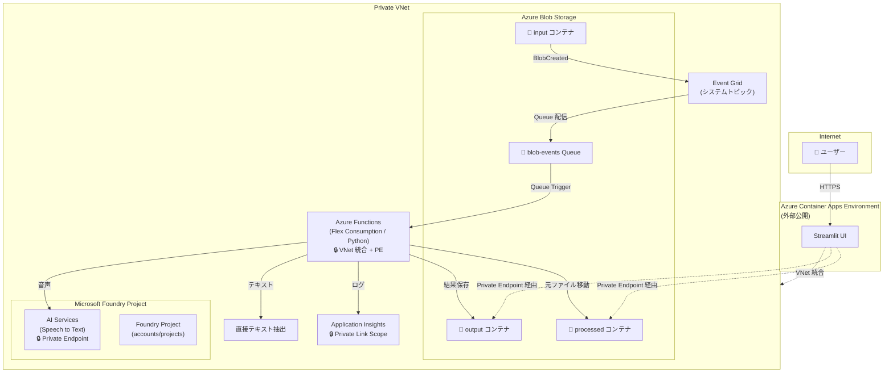

# Azure Blob 文字起こしシステム 要件定義書

## 1. 概要

Azure Blob Storage にアップロードされた音声・テキストファイルの内容を自動で文字起こし（トランスクリプション）し、結果を保管・閲覧できるシステム。

## 2. システム構成概要



**ネットワーク方針**: ACA（Streamlit UI）の Ingress のみ外部公開。それ以外の全リソースは **Private Endpoint / VNet 統合** によるクローズド構成とする。

## 3. 機能要件

### 3.1 ファイル検知・トリガー

| 項目 | 内容 |
|------|------|
| 方式 | Event Grid → Storage Queue → Azure Functions (Queue Trigger) |
| 監視対象 | `input` コンテナへの BlobCreated イベント |
| 配信方式 | Event Grid が Storage Queue (`blob-events`) に配信。Functions が Queue Trigger でポーリング（閉域構成対応） |
| フィルタ | 対応拡張子のみ処理対象（3.2 参照）。それ以外は無視 |

### 3.2 対応ファイル形式

| カテゴリ | 拡張子 | 処理内容 |
|----------|--------|----------|
| 音声 | `.wav`, `.mp3`, `.m4a`, `.ogg`, `.flac`, `.wma` | Azure AI Speech で文字起こし |
| テキスト | `.txt`, `.md`, `.json`, `.vtt` | テキスト抽出（そのままスクリプトとして保存。`.json` は整形して保存） |
| 動画（クライアント側変換） | `.mp4`, `.mov`, `.mkv`, `.webm`, `.avi` | UI のブラウザ内 `ffmpeg.wasm` で音声トラックを **`.mp3` (libmp3lame, 64 kbps mono 16 kHz)** に再エンコード → サーバには音声のみアップロード（サーバ側 FFmpeg 不要） |
| 対象外 | 上記以外（`.docx`/`.pdf` を含むバイナリ、画像、ZIP など） | 処理スキップ。ログに記録 |

> **動画対応について**: サーバ側 FFmpeg を持たず（Flex Consumption の制約）、UI 側 Streamlit カスタムコンポーネント (`ui/components/ffmpeg_extractor/`) でブラウザ内変換しています。詳細は [deploy-guide.md](deploy-guide.md) 参照。巨大動画（目安: 500MB 超）はブラウザメモリの制約で失敗する可能性があるため、その場合は Azure Video Indexer 連携を検討します。
>
> ⚠️ **出力フォーマットは MP3 固定**: 当初は AAC/m4a を出力していたが、ffmpeg.wasm の native AAC encoder + `ipod` コンテナでは `moov` atom がファイル末尾配置となり Azure Speech Batch Transcription が `InvalidData` で拒否するため、libmp3lame に切り替えました。

### 3.3 文字起こし処理

| 項目 | 内容 |
|------|------|
| AI 基盤 | **Microsoft Foundry プロジェクト**（新型 accounts/projects 子リソース）内の AI Services リソースとして Speech サービスを利用 |
| サービス | Azure AI Speech (Speech to Text) - Batch Transcription API |
| 言語 | 日本語 (`ja-JP`)。必要に応じて多言語対応を検討 |
| 話者分離 | **有効**（Diarization）。話者ごとに発話を分離して記録。ステレオ音声でも分離可能にするため、Batch Transcription リクエストで `properties.channels: [0]` を指定し、チャンネル 0 のみを単一チャンネルとして処理する（Speech はマルチチャンネル + diarization の同時利用を許可しないため） |
| Functions ホスティング | Azure Functions Flex Consumption (FC1)。コードデプロイ |
| 接続方式 | Managed Identity 経由で AI Services エンドポイントにアクセス |

> **構成**: AI Services リソース（`kind=AIServices`, `allowProjectManagement=true`）の子リソースとして Foundry Project（`accounts/projects`）を作成。Hub 不要の新型スタンドアロン構成（API `2025-06-01`）。

### 3.4 出力形式

文字起こし結果は **2 種類** のファイルを出力する。

#### プレーンテキスト (.txt)
```
[Speaker 1] こんにちは、本日はお電話ありがとうございます。
[Speaker 2] はい、〇〇の件でお電話しました。
```

#### JSON (.json)
```json
{
  "sourceFile": "call_20260428_001.wav",
  "processedAt": "2026-04-28T10:30:00Z",
  "duration": "PT5M32S",
  "language": "ja-JP",
  "segments": [
    {
      "speaker": "Speaker 1",
      "text": "こんにちは、本日はお電話ありがとうございます。",
      "startTime": "PT0S",
      "endTime": "PT3.2S"
    },
    {
      "speaker": "Speaker 2",
      "text": "はい、〇〇の件でお電話しました。",
      "startTime": "PT3.5S",
      "endTime": "PT6.1S"
    }
  ]
}
```

### 3.5 ファイル管理（Blob コンテナ構成）

| コンテナ名 | 用途 | 説明 |
|------------|------|------|
| `input` | 入力用 | ユーザー/システムが元ファイルをアップロードする場所 |
| `processed` | 処理済み元ファイル | 文字起こし完了後、元ファイルを `input` → `processed` に移動 |
| `output` | 文字起こし結果 | txt / JSON ファイルを保管 |

#### フォルダ構造（output コンテナ）
```
output/
  └── YYYY/MM/DD/
       ├── {元ファイル名}_transcript.txt   ← 成功時
       ├── {元ファイル名}_transcript.json  ← 成功時
       └── {元ファイル名}_error.json       ← 失敗時のみ（エラー詳細マーカー）
```

#### フォルダ構造（processed コンテナ）
```
processed/
  └── YYYY/MM/DD/
       └── {元ファイル名}
```

### 3.6 UI（閲覧画面）

| 項目 | 内容 |
|------|------|
| フレームワーク | Python Streamlit |
| ホスティング | Azure Container Apps |
| 認証 | なし（`allowedIpRanges` による社内 IP 制限のみ、将来的に Microsoft Entra ID 認証追加予定） |

#### UI 画面構成

| 画面 | 機能 |
|------|------|
| ファイル一覧 | 処理済みファイルの一覧表示（日付・ファイル名・ステータス・処理日時） |
| 文字起こし結果表示 | 選択したファイルのトランスクリプトを表示。話者ごとに色分け |
| 元ファイル再生 | 音声ファイルの再生プレーヤー（processed コンテナから取得） |
| システムログ | Functions ログ表示、Queue 状態確認（Log Analytics 連携） |
| 検索・フィルタ | 日付範囲、ファイル名、キーワードでの絞り込み |
| ダウンロード | txt / JSON ファイルのダウンロード |

### 3.7 エラーハンドリング

| ケース | 処理 |
|--------|------|
| 非対応ファイル形式 | 処理スキップ。ログに記録。元ファイルは `input` に残す |
| 文字起こし失敗（最大 3 回リトライ後も失敗） | **失敗を終端化**: ① `output/<y>/<m>/<d>/<stem>_error.json` にエラー詳細を書き出し、② 元ファイルを `input` → `processed` へ移動、③ キューメッセージは正常 dequeue（poison キュー行きを回避）。UI は `_error.json` を検知して **❌ エラー** として一覧表示（理由付き）。 |
| 大容量ファイル | Batch Transcription API で非同期処理。タイムアウトなし |
| 空ファイル / 音声なし | スキップ。ログに「音声コンテンツなし」と記録 |

> **エラーマーカー方式の採用理由**: 旧設計では失敗時に例外を再 raise してキューを poison 行きにしていたが、UI 側の poison メッセージ検知は経路が複雑（Queue peek + ログ突合）で表示の安定性に欠けた。output コンテナにマーカーを書く方式は、UI が Blob を 1 回列挙するだけで確実にエラー一覧化でき、削除も `_error.json` + processed 元ファイルの 2 件削除で完結する。

## 4. 非機能要件

### 4.1 パフォーマンス

| 項目 | 要件 |
|------|------|
| 処理件数 | 未定（スケーラブルな設計とする） |
| 最大ファイルサイズ | 1GB（Batch Transcription API の上限に準拠） |
| 同時処理数 | Azure Functions のスケーリングに委ねる |

### 4.2 セキュリティ・ネットワーク

#### ネットワーク構成方針

ACA（Streamlit UI）のフロントエンド Ingress **のみ外部公開**。バックエンドリソースは **すべて Private VNet 内のクローズド構成** とする。

#### Private Endpoint / VNet 統合 対象

| リソース | ネットワーク構成 | 説明 |
|----------|------------------|------|
| Azure Blob Storage | **Private Endpoint**（+ Trusted Service） | Private Endpoint 経由アクセスを基本とする。データストレージは `publicNetworkAccess=Enabled` + `defaultAction=Deny` とし、AI Services のみ `resourceAccessRules` で許可（Speech Batch Transcription の Trusted Access 要件）。ファンクションランタイム用ストレージは `publicNetworkAccess=Disabled`。 |
| Azure Functions | **VNet 統合 + Private Endpoint** | Functions → 外部通信は VNet 経由。受信も Private Endpoint で制限 |
| Azure AI Foundry Project | **Private Endpoint** | プロジェクト自体に Private Endpoint を設定。配下の AI Services も閉域アクセス |
| Application Insights | **Azure Monitor Private Link Scope (AMPLS)** | ログ送信・クエリを Private Link 経由に制限 |
| Azure Container Apps | **External Ingress（公開）+ VNet 統合（送信）** | UI は外部公開。バックエンドへの通信は VNet 統合経由 |
| Event Grid | **Storage Queue 配信**（閉域: AzureServices バイパスで配信可能） |

#### VNet 設計

| サブネット | 用途 | CIDR（例） |
|------------|------|------------|
| `snet-functions` | Azure Functions VNet 統合 | `10.0.1.0/24` |
| `snet-aca` | Container Apps Environment | `10.0.2.0/23` |
| `snet-privateendpoints` | 各種 Private Endpoint 配置 | `10.0.4.0/24` |

#### その他セキュリティ

| 項目 | 内容 |
|------|------|
| Blob アクセス | Managed Identity による認証（キーレス）。SAS / アクセスキー無効化 |
| Blob パブリックアクセス | **無効**（`allowBlobPublicAccess: false`） |
| UI アクセス | 社内 NW 制限（IP 制限 or VPN 経由）。認証なし |
| データ保持 | 保持期間は運用ポリシーに従う（ライフサイクル管理で自動削除を検討） |
| DNS | Private DNS Zone を使用（`privatelink.blob.core.windows.net` 等） |

#### データ用 Blob Storage の要件

| 項目 | 設定値 | 理由 |
|------|--------|------|
| `publicNetworkAccess` | **`Enabled`** | Speech Batch Transcription は Trusted Service 経由で Storage を fetch する際、パブリックエンドポイントが有効である必要がある（`Disabled` にすると `resourceAccessRules` が機能せず `InvalidData: The recordings URI contains invalid data.` で失敗する）。 |
| `networkAcls.defaultAction` | **`Deny`** | パブリックエンドポイント自体は開いているが、デフォルトで全リクエストを拒否し、明示的に許可した送信元のみ通す。 |
| `networkAcls.bypass` | **`AzureServices`** | Trusted Azure Services 経由のアクセスを許可（Speech / Event Grid 連携の前提）。 |
| `networkAcls.resourceAccessRules` | AI Services リソース ID を登録 | Speech Batch Transcription バックエンドが、登録された AI Services 経由で発行されたジョブに対してのみ Storage アクセスを許可。 |
| `allowSharedKeyAccess` | **`false`** | アカウントキー / SAS 認証を全面禁止し、Entra ID 認証のみに統一。 |
| `allowBlobPublicAccess` | **`false`** | コンテナ単位の匿名読み取りを禁止。 |
| Private Endpoint | **Blob / Queue / Table の 3 つを配置** | Functions・Container Apps・デプロイ実行者は VNet 統合 → Private DNS Zone 経由で PE に名前解決してアクセス。 |
| CLI からの手動アップロード | 自分の IP を `network-rule add` で一時許可 | デプロイ運用者やテスト時に必要。`publicNetworkAccess` の切替は不要。テスト完了後は IP ルールのみ削除。詳細は [deploy-guide.md](./deploy-guide.md) セクション 9・11 を参照。 |

> **Functions ランタイム用ストレージ** (`sttranscriptionfunc{env}`) は AI Services Trusted Access が不要のため `publicNetworkAccess: Disabled` で完全閉域化する。azd デプロイ時のみ hooks (`predeploy` / `postdeploy`) で一時開放・再閉域化を自動実行する。

### 4.3 監視・ログ

| 項目 | 内容 |
|------|------|
| ログ出力先 | Application Insights |
| 監視対象 | 処理成功/失敗件数、処理時間、エラー内容 |
| アラート | 連続エラー発生時に通知（メール or Teams） |

## 5. Azure リソース一覧

| リソース | 用途 | ネットワーク |
|----------|------|------|
| Azure Virtual Network | 全リソースの閉域接続基盤 | - |
| Azure Blob Storage | ファイル保管（input / processed / output）+ Event Grid Queue | Private Endpoint (blob + queue) |
| Azure Event Grid | Blob イベント検知 → Storage Queue 配信 | システムトピック |
| Azure Functions (Python, Flex Consumption) | Queue Trigger → 文字起こし処理 | VNet 統合 + Private Endpoint |
| Azure AI Services (kind=AIServices) | 音声→テキスト変換（Batch Transcription API） | Private Endpoint |
| Microsoft Foundry Project | AI サービスのプロジェクト管理（accounts/projects 子リソース） | 親リソースの PE 経由 |
| Azure Container Registry (Premium) | Streamlit UI Docker イメージ管理 | Private Endpoint |
| Azure Container Apps | Streamlit UI ホスティング | External Ingress + VNet 統合 |
| Application Insights | ログ・監視 | Azure Monitor Private Link Scope |
| Private DNS Zones | Private Endpoint の名前解決 | VNet リンク |

## 6. 処理フロー

```
1. ユーザーが input コンテナにファイルをアップロード
2. Event Grid が BlobCreated イベントを検知
3. Event Grid が Storage Queue (blob-events) にメッセージを配信
4. Azure Functions が Queue Trigger でメッセージを取得
5. 拡張子チェック
   - 対象外 → スキップ（ログ記録）
   - テキスト系 → テキスト抽出
   - 音声 → 6 へ
6. Azure AI Speech Batch Transcription API で文字起こし（話者分離有効）
   - 成功 → 7（成功フロー）
   - 3 回リトライしても失敗 → 7'（失敗フロー）
7. 成功フロー: 結果を txt / JSON で output コンテナに保存 → 元ファイルを input → processed へ移動
7'. 失敗フロー: `_error.json` を output コンテナに書き出し → 元ファイルを input → processed へ移動
    → キューメッセージは正常 dequeue（poison キュー化を回避）
8. 処理結果を Application Insights にログ出力
9. UI は output コンテナを列挙し、`_transcript.json` を ✅ 処理済み、`_error.json` を ❌ エラーとして一覧表示
```

## 7. 今後の拡張検討事項

- [ ] 大容量動画対応（ブラウザ抽出の限界を超える場合の Azure Video Indexer 連携）
- [ ] 要約機能（Foundry Project に Azure OpenAI を追加し、文字起こし結果の自動要約）
- [ ] 感情分析（Foundry Project の AI サービスで通話内容のセンチメント分析）
- [ ] 多言語対応（英語等の自動言語検出）
- [ ] Entra ID 認証の追加（外部アクセス対応時）
- [ ] 処理件数・サイズの制限値の確定
- [ ] データ保持ポリシーの確定（自動削除ルール）

