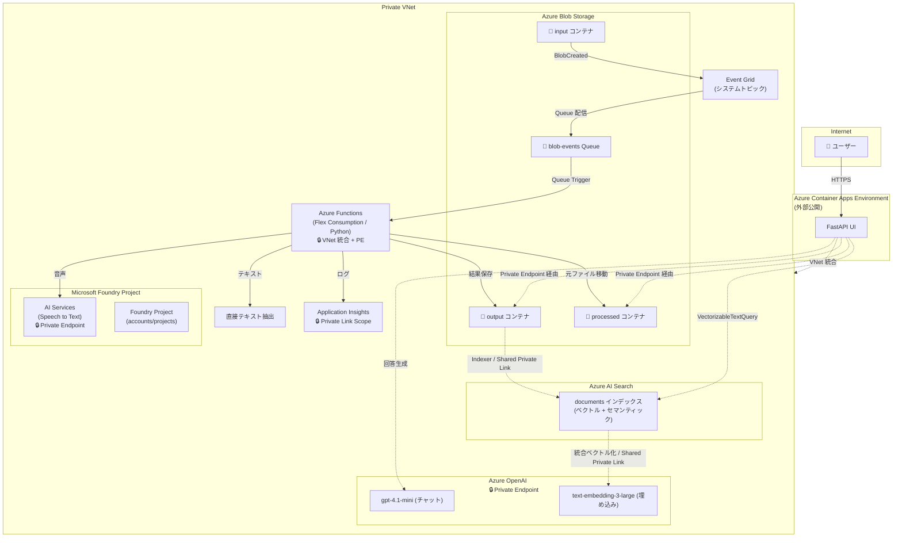

# Azure Blob 文字起こしシステム 要件定義書

## 1. 概要

Azure Blob Storage にアップロードされた音声・テキストファイルの内容を自動で文字起こし（トランスクリプション）し、結果を保管・閲覧できるシステム。

## 2. システム構成概要



**ネットワーク方針**: ACA（FastAPI UI）の Ingress のみ外部公開。それ以外の全リソースは **Private Endpoint / VNet 統合** によるクローズド構成とする。

## 3. 機能要件

### 3.1 ファイル検知・トリガー

| 項目 | 内容 |
|------|------|
| 方式 | Event Grid → Storage Queue → Azure Functions (Queue Trigger) |
| 監視対象 | `input` コンテナへの BlobCreated イベント |
| 配信方式 | Event Grid が Storage Queue (`blob-events`) に配信。Functions が Queue Trigger でポーリング（閉域構成対応） |
| フィルタ | 対応拡張子のみ処理対象（3.2 参照）。それ以外は無視 |

### 3.2 対応ファイル形式

| カテゴリ | 拡張子 | 処理内容 |
|----------|--------|----------|
| 音声 | `.wav`, `.mp3`, `.m4a`, `.ogg`, `.flac`, `.wma` | Azure AI Speech で文字起こし |
| テキスト | `.txt`, `.md`, `.json`, `.vtt` | テキスト抽出（そのままスクリプトとして保存。`.json` は整形して保存） |
| 対象外 | 上記以外（動画、`.docx`/`.pdf` を含むバイナリ、画像、ZIP など） | 処理スキップ。ログに記録 |

動画を処理する場合は、Functions へ投入する前に音声トラックを対応音声形式へ変換する。

### 3.3 文字起こし処理

| 項目 | 内容 |
|------|------|
| AI 基盤 | **Microsoft Foundry プロジェクト**（新型 accounts/projects 子リソース）内の AI Services リソースとして Speech サービスを利用 |
| サービス | Azure AI Speech (Speech to Text) - Batch Transcription API v3.2 |
| 言語 | 日本語 (`ja-JP`)。必要に応じて多言語対応を検討 |
| 話者分離 | **Diarization 有効** + `properties.channels: [0]` 指定（詳細は下記「話者分離の方式と設定理由」参照） |
| Functions ホスティング | Azure Functions Flex Consumption (FC1)。コードデプロイ |
| 接続方式 | Managed Identity 経由で AI Services エンドポイントにアクセス |

> **構成**: AI Services リソース（`kind=AIServices`, `allowProjectManagement=true`）の子リソースとして Foundry Project（`accounts/projects`）を作成。Hub 不要の新型スタンドアロン構成（API `2025-06-01`）。

#### 話者分離の方式と設定理由

##### 前提知識: 音声のチャンネルと話者識別

音声ファイルは「チャンネル」という独立した音声トラックを持つ。

| 種類 | チャンネル数 | 典型例 |
|------|--------------|--------|
| モノラル | 1 | ボイスメモ、電話の片側録音、会議の単一マイク |
| ステレオ | 2 | 自分=L / 相手=R で録音した PC 会議 |
| マルチチャンネル | 3 以上 | 多人数会議で 1 人 1 マイクの multi-track 録音 |

Azure Speech Batch Transcription には**話者を識別する 2 つの異なる方式**がある。

| 方式 | 仕組み | 適した録音 |
|------|--------|------------|
| **Multi-channel transcription** | 各チャンネルを独立した話者として扱う（L=話者A、R=話者B 固定） | 物理的に話者がチャンネル分離されている録音（コールセンター録音等） |
| **Diarization** | 音声内容から AI が話者を推定（声紋ベース） | 1 チャンネルに複数人が混在する録音（会議室の単一マイク等） |

そして Speech には次の制約がある:

> ⚠️ **マルチチャンネル処理と Diarization は同時利用不可**

ステレオ音声をそのまま投げて「ステレオ扱いしつつ Diarization もする」はエラーになる。

##### 本システムの設計選択

本システムはユーザーが多様なソース（モノラル / ステレオ / 動画から抽出した音声）をアップロードする前提のため、**入力フォーマットに依らず Diarization で統一的に話者分離する** 方針とした。

そのために Batch Transcription リクエストで以下を指定する。

```jsonc
{
  "properties": {
    "diarizationEnabled": true,
    "channels": [0]   // 0-origin: L チャンネルのみ処理
  }
}
```

`channels: [0]` を指定する効果:

1. Speech が**強制的にシングルチャンネル処理**として動作する
2. multi-channel 経路に入らないため **Diarization と共存可能**
3. ステレオファイルでも L チャンネル（index 0）のみを使用し、AI が声紋で話者推定
4. モノラルファイルでは元々 ch 0 しかないため安全に動作

> 💡 **将来検討**: コールセンター録音のように「物理的に話者が左右分離されている」用途が増えた場合は、リクエストごとに `channels` 指定の有無を切り替える分岐を入れることで multi-channel 方式も併用可能。

### 3.4 出力形式

文字起こし結果は **2 種類** のファイルを出力する。

#### プレーンテキスト (.txt)
```
[Speaker 1] こんにちは、本日はお電話ありがとうございます。
[Speaker 2] はい、〇〇の件でお電話しました。
```

#### JSON (.json)
```json
{
  "sourceFile": "call_20260428_001.wav",
  "processedAt": "2026-04-28T10:30:00Z",
  "duration": "PT5M32S",
  "language": "ja-JP",
  "segments": [
    {
      "speaker": "Speaker 1",
      "text": "こんにちは、本日はお電話ありがとうございます。",
      "startTime": "PT0S",
      "endTime": "PT3.2S"
    },
    {
      "speaker": "Speaker 2",
      "text": "はい、〇〇の件でお電話しました。",
      "startTime": "PT3.5S",
      "endTime": "PT6.1S"
    }
  ]
}
```

### 3.5 ファイル管理（Blob コンテナ構成）

| コンテナ名 | 用途 | 説明 |
|------------|------|------|
| `input` | 入力用 | ユーザー/システムが元ファイルをアップロードする場所 |
| `processed` | 処理済み元ファイル | 文字起こし完了後、元ファイルを `input` → `processed` に移動 |
| `output` | 文字起こし結果 | txt / JSON ファイルを保管 |

#### フォルダ構造（output コンテナ）
```
output/
  └── YYYY/MM/DD/
       ├── {元ファイル名}_transcript.txt   ← 成功時
       ├── {元ファイル名}_transcript.json  ← 成功時
       └── {元ファイル名}_error.json       ← 失敗時のみ（エラー詳細マーカー）
```

#### フォルダ構造（processed コンテナ）
```
processed/
  └── YYYY/MM/DD/
       └── {元ファイル名}
```

### 3.6 UI（閲覧画面）

| 項目 | 内容 |
|------|------|
| フレームワーク | Python FastAPI + Jinja2 + JavaScript |
| ホスティング | Azure Container Apps |
| 認証 | なし（`allowedIpRanges` による社内 IP 制限のみ、将来的に Microsoft Entra ID 認証追加予定） |

#### UI 画面構成

| 画面 | 機能 |
|------|------|
| リアルタイム文字起こし | WebSocket で音声を送信し、リアルタイム結果を表示 |
| 履歴 | 会議履歴、分析結果、チャット履歴を表示 |
| ファイル一覧 | 処理済みファイルの一覧表示（日付・ファイル名・ステータス・処理日時） |
| 文字起こし結果表示 | 選択したファイルのトランスクリプトを表示。話者ごとに色分け |
| 元ファイル再生 | 音声ファイルの再生プレーヤー（processed コンテナから取得） |
| 検索・フィルタ | 日付範囲、ファイル名、キーワードでの絞り込み |
| ダウンロード | txt / JSON ファイルのダウンロード |
| AI質問（RAG） | 表示中の文字起こしを対象に自然言語で質問し、根拠付きで回答（3.8 参照） |
| OCR | 文書アップロード、OCR 実行、結果閲覧・ダウンロード |

### 3.7 エラーハンドリング

| ケース | 処理 |
|--------|------|
| 非対応ファイル形式 | 処理スキップ。ログに記録。元ファイルは `input` に残す |
| 重複イベント（Queue 再配信） | Queue は at-least-once 配信のため同一 blob のイベントが再配信され得る。処理成功時は元ファイルが `input` → `processed` へ移動して消えるので、**`input` に元ファイルが存在しなければ処理済みとみなしスキップ**（冪等性）。 |
| 認証・権限エラー | リトライしても回復しないため**即座に終端化**（3 回待たずに `_error.json` 出力 + `processed` 退避）。 |
| 文字起こし失敗（最大 3 回リトライ後も失敗） | **失敗を終端化**: ① `output/<y>/<m>/<d>/<stem>_error.json` にエラー詳細を書き出し、② 元ファイルを `input` → `processed` へ移動、③ キューメッセージは正常 dequeue（poison キュー行きを回避）。UI は `_error.json` を検知して **❌ エラー** として一覧表示（理由付き）。 |
| 大容量ファイル | Batch Transcription API で非同期処理。タイムアウトなし |
| 空ファイル / 音声なし | スキップ。ログに「音声コンテンツなし」と記録 |

> **エラーマーカー方式の採用理由**: 旧設計では失敗時に例外を再 raise してキューを poison 行きにしていたが、UI 側の poison メッセージ検知は経路が複雑（Queue peek + ログ突合）で表示の安定性に欠けた。output コンテナにマーカーを書く方式は、UI が Blob を 1 回列挙するだけで確実にエラー一覧化でき、削除も `_error.json` + processed 元ファイルの 2 件削除で完結する。

### 3.8 RAG（文字起こし内容への AI 質問）機能

UI 上で、表示中の文字起こしを対象に自然言語で質問し、根拠付きの回答を得られる機能（Retrieval-Augmented Generation）。

| 項目 | 内容 |
|------|------|
| AI 基盤 | Azure OpenAI（チャットモデル / 埋め込み: `text-embedding-3-large` 3,072 次元） |
| 検索基盤 | Azure AI Search（`documents` インデックス。ベクトル + セマンティック ハイブリッド検索） |
| 認証 | UI と Search の Managed Identity（キーレス）。AI Services / Search ともにローカル認証を無効化 |
| 有効化条件 | `AZURE_OPENAI_ENDPOINT` / `AZURE_OPENAI_CHAT_DEPLOYMENT` / `AZURE_SEARCH_ENDPOINT` が揃うと自動で有効（`RAG_ENABLED`）。未設定時は質問 UI を非表示にし、ダッシュボード本体は動作 |

#### インデックス登録（indexer + 統合ベクトル化）

`azd provision` の `postprovision` フックが Search のデータプレーンを構成し、`output` コンテナの文字起こし JSON を pull 型で登録する。

1. Search から Storage と Azure OpenAI への shared private link を承認する
2. `documents` index、`ds-transcripts` datasource、`ss-transcripts` skillset、`ix-transcripts` indexer を作成する
3. Merge skill で `segments/*/text` を結合する
4. Split skill で最大 2,000 文字、500 文字オーバーラップのチャンクに分割する
5. Azure OpenAI embedding skill で 3,072 次元ベクトルを生成する
6. index projection でチャンクごとの子ドキュメントを `documents` に格納する

Search は通常 `publicNetworkAccess=Disabled` とし、Storage / Azure OpenAI への通信は shared private link を使用する。`postprovision` のデータプレーン設定中だけ Public Access を一時的に有効化し、終了時に必ず無効化する。

#### 質問〜回答（検索パイプライン）

1. 質問の意図をチャットモデルで要約する
2. 意図から検索クエリを生成（AI 最適化は ON/OFF 可能）
3. UI が `VectorizableTextQuery` を Search へ送り、Search の vectorizer が Azure OpenAI でクエリをベクトル化する
4. 検索ヒットのみを根拠に回答を生成（出典番号 `[1][2]` 付き）

#### インデックス スキーマ（`documents`）

| フィールド | 型 | 役割 |
|-----------|-----|------|
| `id` | String (key/searchable, keyword analyzer) | index projection が生成する一意キー。projection target の要件として `keyword` analyzer を設定 |
| `parent_id` | String (filter) | 元の文字起こし JSON とチャンクを関連付ける親キー |
| `chunk` | SearchableString | チャンク本文（全文 + セマンティック対象） |
| `source_file` | String (filter/facet) | 元音声ファイル名 |
| `transcript_path` | String (filter) | 文字起こし JSON の Storage パス |
| `title` | SearchableString | セマンティック検索の title field |
| `text_vector` | Collection(Single) | 埋め込みベクトル（3,072 次元 / HNSW） |

## 4. 非機能要件

### 4.1 パフォーマンス

| 項目 | 要件 |
|------|------|
| 処理件数 | 未定（スケーラブルな設計とする） |
| 最大ファイルサイズ | 1GB（Batch Transcription API の上限に準拠） |
| 同時処理数 | Azure Functions のスケーリングに委ねる |

### 4.2 セキュリティ・ネットワーク

#### ネットワーク構成方針

ACA（FastAPI UI）のフロントエンド Ingress **のみ外部公開**。バックエンドリソースは **すべて Private VNet 内のクローズド構成** とする。

#### Private Endpoint / VNet 統合 対象

| リソース | ネットワーク構成 | 説明 |
|----------|------------------|------|
| Azure Blob Storage | **Private Endpoint**（+ Trusted Service） | Private Endpoint 経由アクセスを基本とする。データストレージは `publicNetworkAccess=Enabled` + `defaultAction=Deny` とし、AI Services のみ `resourceAccessRules` で許可（Speech Batch Transcription の Trusted Access 要件）。ファンクションランタイム用ストレージは `publicNetworkAccess=Disabled`。 |
| Azure Functions | **VNet 統合 + Private Endpoint** | Functions → 外部通信は VNet 経由。受信も Private Endpoint で制限 |
| Azure AI Foundry Project | **Private Endpoint**（受信）+ **network injection**（送信） | プロジェクト自体に Private Endpoint を設定し閉域受信。送信は `networkInjections`（`scenario=agent`）で `snet-agent` に注入し **Agent Service の送信を VNet 統合**。ただし Batch Transcription / OpenAI 推論の送信は対象外（Microsoft バックボーン経由）。`networkInjections` は **create-only**（作成時のみ設定可・後付け不可）。 |
| Application Insights | **Azure Monitor Private Link Scope (AMPLS)** | ログ送信・クエリを Private Link 経由に制限 |
| Azure OpenAI | **Private Endpoint**（`privatelink.openai.azure.com`） | UI の回答生成と Search の統合ベクトル化から閉域アクセスする |
| Azure AI Search | **Private Endpoint + shared private link** | UI は PE 経由で検索する。Search は shared private link 経由で Storage / Azure OpenAI に接続する |
| Azure Container Apps | **External Ingress（公開）+ VNet 統合（送信）** | UI は外部公開。バックエンドへの通信は VNet 統合経由 |
| Event Grid | **Storage Queue 配信**（閉域: AzureServices バイパスで配信可能） |

#### VNet 設計

| サブネット | 用途 | CIDR（例） |
|------------|------|------------|
| `snet-functions` | Azure Functions VNet 統合 | `10.0.1.0/24` |
| `snet-aca` | Container Apps Environment | `10.0.2.0/23` |
| `snet-privateendpoints` | 各種 Private Endpoint 配置 | `10.0.4.0/24` |
| `snet-agent` | Foundry Agent Service 送信の VNet 注入（`Microsoft.App/environments` 委任・/27 以上） | `10.0.5.0/24` |

4 subnet は VNet リソースの `properties.subnets` にインライン定義し、VNet と subnet を1回の PUT で原子的に作成する。下流モジュールは `existing` child resource の ID を参照し、VNet 作成との競合を防ぐ。

Azure AI Search は `AZURE_SEARCH_LOCATION` で主リージョンから分離でき、既定値は `eastus` とする。Search サービスが別リージョンでも、Private Endpoint は VNet の主リージョンに配置する。

#### その他セキュリティ

| 項目 | 内容 |
|------|------|
| Blob アクセス | Managed Identity による認証（キーレス）。SAS / アクセスキー無効化 |
| Blob パブリックアクセス | **無効**（`allowBlobPublicAccess: false`） |
| UI アクセス | 社内 NW 制限（IP 制限 or VPN 経由）。認証なし |
| データ保持 | 保持期間は運用ポリシーに従う（ライフサイクル管理で自動削除を検討） |
| DNS | Private DNS Zone を使用（`privatelink.blob.core.windows.net` 等） |

#### データ用 Blob Storage の要件

| 項目 | 設定値 | 理由 |
|------|--------|------|
| `publicNetworkAccess` | **`Enabled`** | Speech Batch Transcription は Trusted Service 経由で Storage を fetch する際、パブリックエンドポイントが有効である必要がある（`Disabled` にすると `resourceAccessRules` が機能せず `InvalidData: The recordings URI contains invalid data.` で失敗する）。 |
| `networkAcls.defaultAction` | **`Deny`** | パブリックエンドポイント自体は開いているが、デフォルトで全リクエストを拒否し、明示的に許可した送信元のみ通す。 |
| `networkAcls.bypass` | **`AzureServices`** | Trusted Azure Services 経由のアクセスを許可（Speech / Event Grid 連携の前提）。 |
| `networkAcls.resourceAccessRules` | AI Services リソース ID を登録 | Speech Batch Transcription バックエンドが、登録された AI Services 経由で発行されたジョブに対してのみ Storage アクセスを許可。 |
| `allowSharedKeyAccess` | **`false`** | アカウントキー / SAS 認証を全面禁止し、Entra ID 認証のみに統一。 |
| `allowBlobPublicAccess` | **`false`** | コンテナ単位の匿名読み取りを禁止。 |
| Private Endpoint | **Blob / Queue の 2 つを配置**（データ Storage） | Functions・Container Apps・デプロイ実行者は VNet 統合 → Private DNS Zone 経由で PE に名前解決してアクセス。Functions ランタイム用ストレージには別途 Blob / Table の PE を配置（Flex Consumption 要件）。 |
| CLI からの手動アップロード | 自分の IP を `network-rule add` で一時許可 | デプロイ運用者やテスト時に必要。`publicNetworkAccess` の切替は不要。テスト完了後は IP ルールのみ削除。詳細は [deploy-guide.md](./deploy-guide.md) セクション 9・11 を参照。 |

> **Functions ランタイム用ストレージ** (`sttranscriptionfunc{env}`) は AI Services Trusted Access が不要のため `publicNetworkAccess: Disabled` で完全閉域化する。azd デプロイ時のみ hooks (`predeploy` / `postdeploy`) で一時開放・再閉域化を自動実行する。

### 4.3 監視・ログ

| 項目 | 内容 |
|------|------|
| ログ出力先 | Application Insights |
| 監視対象 | 処理成功/失敗件数、処理時間、エラー内容 |
| アラート | 連続エラー発生時に通知（メール or Teams） |

## 5. Azure リソース一覧

| リソース | 用途 | ネットワーク |
|----------|------|------|
| Azure Virtual Network | 全リソースの閉域接続基盤 | - |
| Azure Blob Storage | ファイル保管（input / processed / output）+ Event Grid Queue | Private Endpoint (blob + queue) |
| Azure Event Grid | Blob イベント検知 → Storage Queue 配信 | システムトピック |
| Azure Functions (Python, Flex Consumption) | Queue Trigger → 文字起こし処理 | VNet 統合 + Private Endpoint |
| Azure AI Services (kind=AIServices) | 音声→テキスト変換（Batch Transcription API） | Private Endpoint |
| Microsoft Foundry Project | AI サービスのプロジェクト管理（accounts/projects 子リソース） | 親リソースの PE 経由 |
| Azure OpenAI | RAG のチャット(回答生成)・埋め込み(ベクトル化) | Private Endpoint |
| Azure AI Search | 文字起こしチャンクのベクトル/セマンティック検索（`documents` インデックス） | Private Endpoint |
| Azure Container Registry (Premium) | FastAPI UI Docker イメージ管理 | Private Endpoint |
| Azure Container Apps | FastAPI UI ホスティング | External Ingress + VNet 統合 |
| Application Insights | ログ・監視 | Azure Monitor Private Link Scope |
| Private DNS Zones | Private Endpoint の名前解決 | VNet リンク |

## 6. 処理フロー

```
1. ユーザーが input コンテナにファイルをアップロード
2. Event Grid が BlobCreated イベントを検知
3. Event Grid が Storage Queue (blob-events) にメッセージを配信
4. Azure Functions が Queue Trigger でメッセージを取得
5. 拡張子チェック
   - 対象外 → スキップ（ログ記録）
   - テキスト系 → テキスト抽出
   - 音声 → 6 へ
6. Azure AI Speech Batch Transcription API で文字起こし（話者分離有効）
   - 成功 → 7（成功フロー）
   - 3 回リトライしても失敗 → 7'（失敗フロー）
7. 成功フロー: 結果を txt / JSON で output コンテナに保存 → 元ファイルを input → processed へ移動
7'. 失敗フロー: `_error.json` を output コンテナに書き出し → 元ファイルを input → processed へ移動
    → キューメッセージは正常 dequeue（poison キュー化を回避）
8. 処理結果を Application Insights にログ出力
9. UI は output コンテナを列挙し、`_transcript.json` を ✅ 処理済み、`_error.json` を ❌ エラーとして一覧表示
```

## 7. 今後の拡張検討事項

- [ ] 大容量動画対応（ブラウザ抽出の限界を超える場合の Azure Video Indexer 連携）
- [x] 文字起こし内容への AI 質問（RAG）機能 — 実装済み（3.8 参照）
- [ ] 要約機能（文字起こし結果の自動要約。RAG 基盤の Azure OpenAI を流用予定）
- [ ] 感情分析（Foundry Project の AI サービスで通話内容のセンチメント分析）
- [ ] 多言語対応（英語等の自動言語検出）
- [ ] Entra ID 認証の追加（外部アクセス対応時）
- [ ] 処理件数・サイズの制限値の確定
- [ ] データ保持ポリシーの確定（自動削除ルール）

